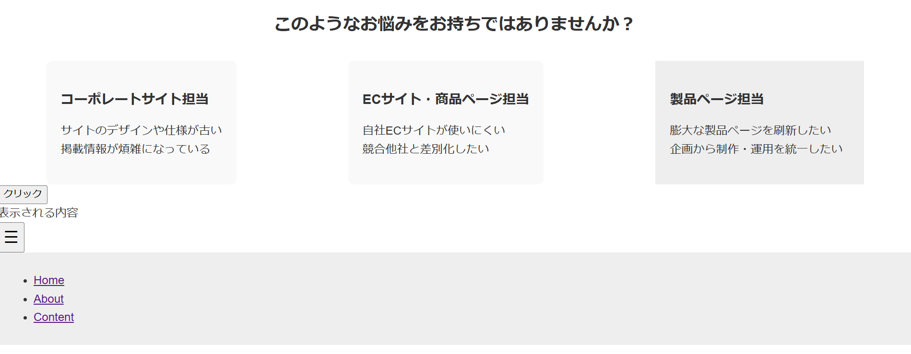
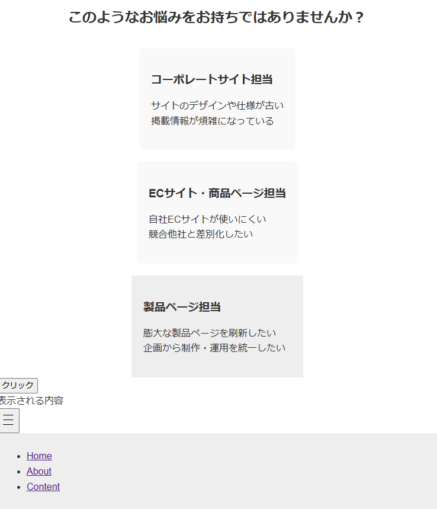

# サービス紹介ページ（模写制作）

## 概要
サービス紹介ページの模写制作です。

## 制作内容
 - HTML
 - CSS（FlexBox）
 - JavaScript（classの付け外し）

## 実装内容
 - レスポンシブ対応（PC / スマホ）
 - FlexBoxによる3カラムレイアウト
 - スマホは縦並びに切り替え
 - カード型デザインで視認性を意識
 - ハンバーガーメニューの実装

 
 